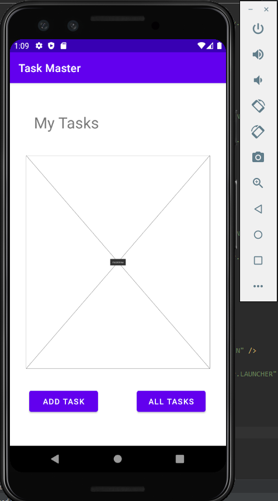
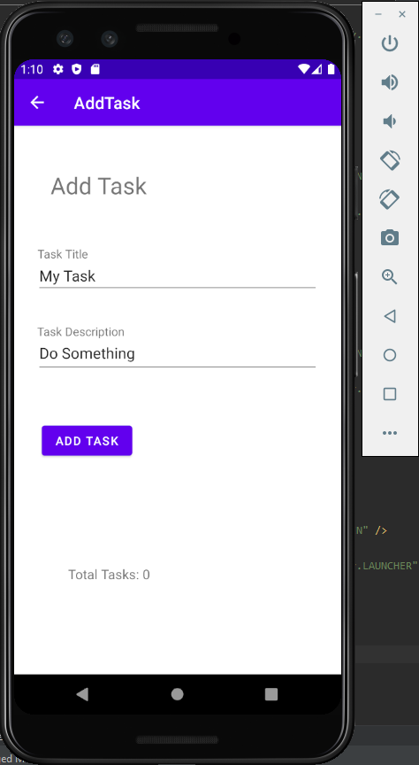
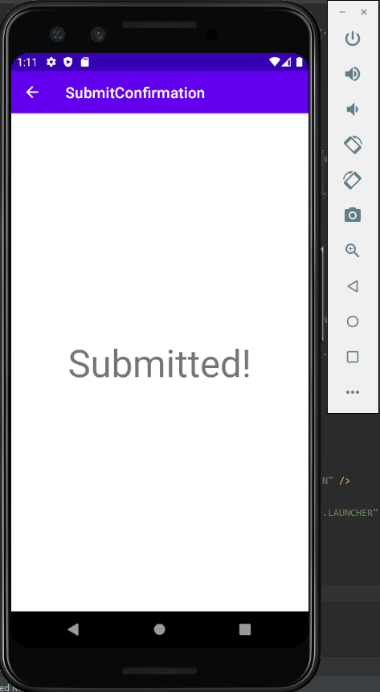
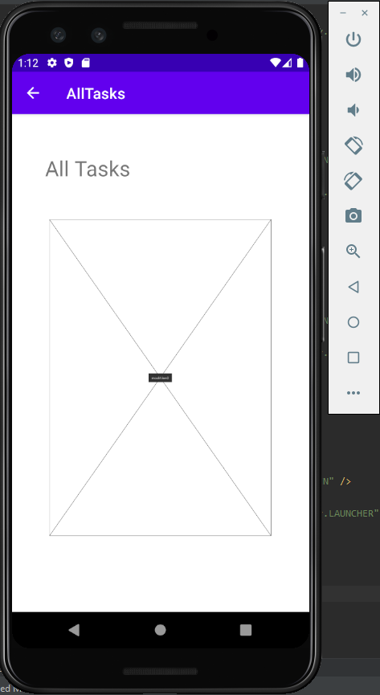
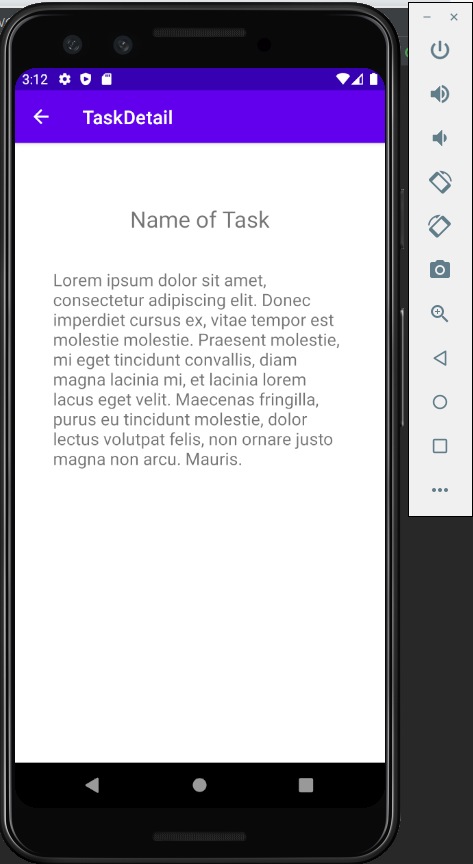
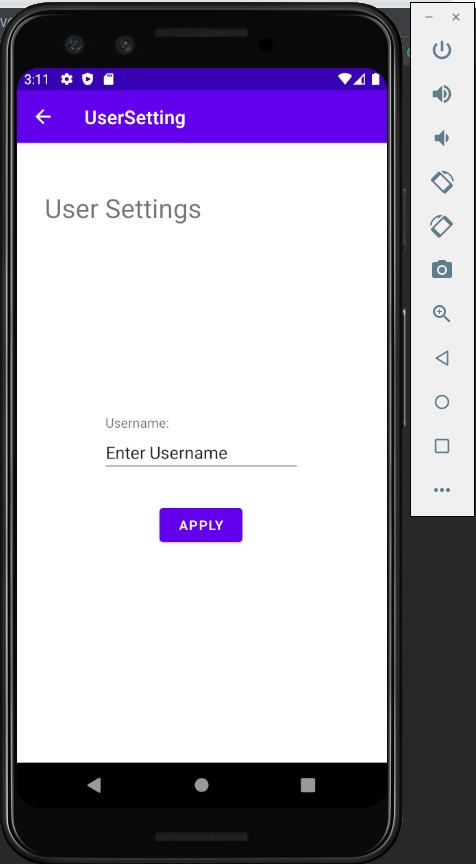

# Task Master

## Overview

- The Task Master app lets you add daily tasks to your list to keep note of things to do.

## App Page Layout

### Homepage

### Updated Homepage

### Add Task

### Submit Confirmation

### All Tasks

### Task Detail

### User Settings

## Daily Change Log

- 10/19/2020
  - Created the home, add, submit confirmation and all tasks pages.
- 10/20/2020
  - Updated the homepage with three more buttons that lead to the new task detail page. Also created a user settings page where the user can update their username.
  - Took out the submit confirmation page after adding a task and replaced with a toast instead.
- 10/21/2020
  - 
- 10/22/2020
  - Updated the Add Task page to save task data to my local database.
  - Refactored homepage RecycleView to display all tasks in my database.
  - Task detail page reflects clicked task title and description. 
  
