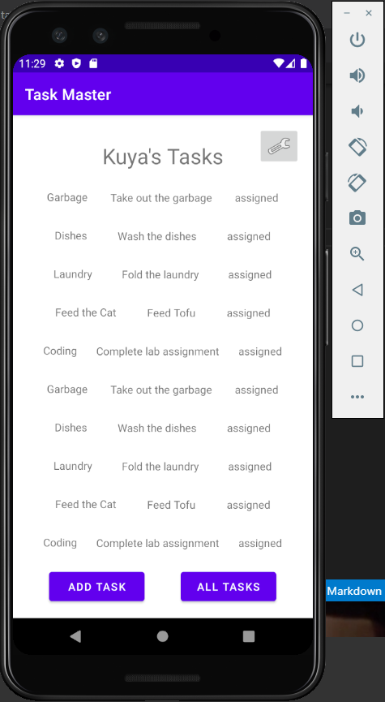
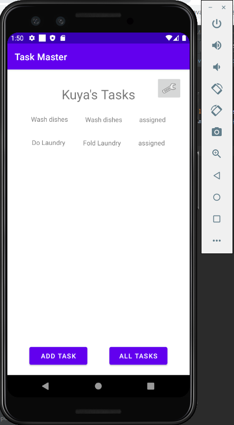
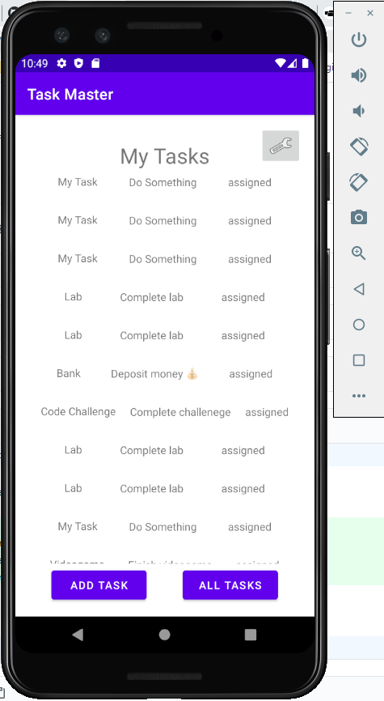
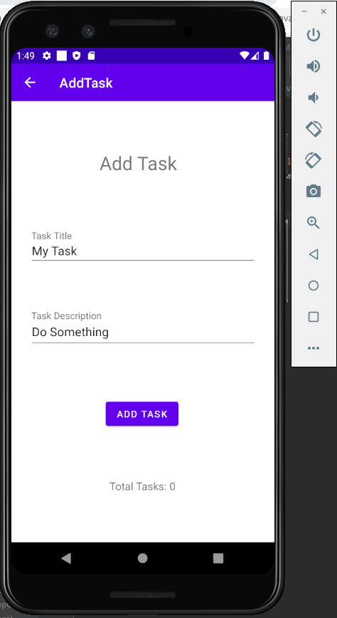
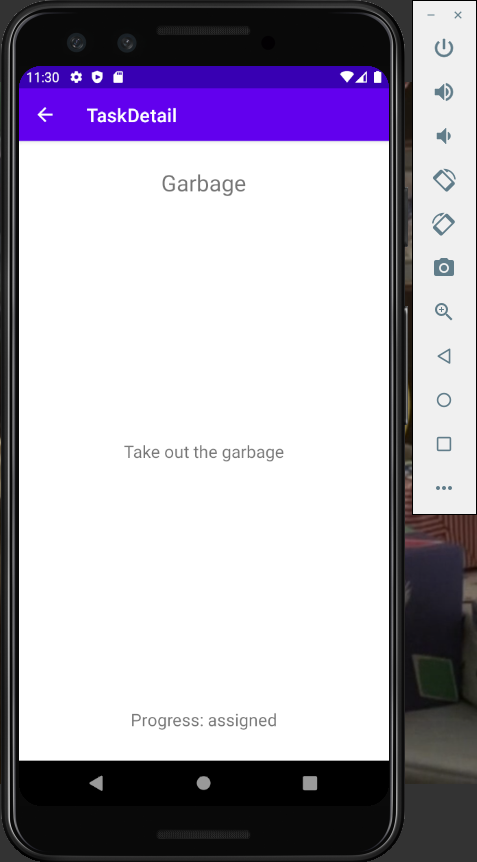

# Task Master

## Overview

- The Task Master app lets you add daily tasks to your list to keep note of things to do.

## App Page Layout

### Homepage

### Updated Homepage

### Updated Homepage 10/21

### Updated Homepage 10/22

### Updated Hompage 10/27

### Add Task

### Updated Add Task 10/22

### Submit Confirmation

### All Tasks

### Task Detail

### Updated Task Detail 10/21

### User Settings

## Daily Change Log

- 10/19/2020
  - Created the home, add, submit confirmation and all tasks pages.
- 10/20/2020
  - Updated the homepage with three more buttons that lead to the new task detail page. Also created a user settings page where the user can update their username.
  - Took out the submit confirmation page after adding a task and replaced with a toast instead.
- 10/21/2020
  - Updated the homepage with the recycler view to show a list of tasks
  - Made the list of tasks clickable
  - Created a task class
- 10/22/2020
  - Updated the Add Task page to save task data to my local database.
  - Refactored homepage RecycleView to display all tasks in my database.
  - Task detail page reflects clicked task title and description.
- 10/26/2020
  - Created Espresso tests for homepage button paths and back button functionality
  - Created Espresso tests for adding a new tasks to the recycler view on homepage
  - Created Espresso tests for adding a new username and have the new username viewable on the homepage
- 10/26/2020
  - Connected to DynamoDB using Amplify
  - Homepage list is updated from DynamoBW
  - Added tasks are now saved to DynamoDB instead of room
