# Task Master

## Overview

- The Task Master app lets you add daily tasks to your list to keep note of things to do.

## App Page Layout

### Homepage

### Updated Homepage

### Updated Homepage 10/21

### Updated Homepage 10/22

### Updated Hompage 10/27

### Updated Homepage 10/29

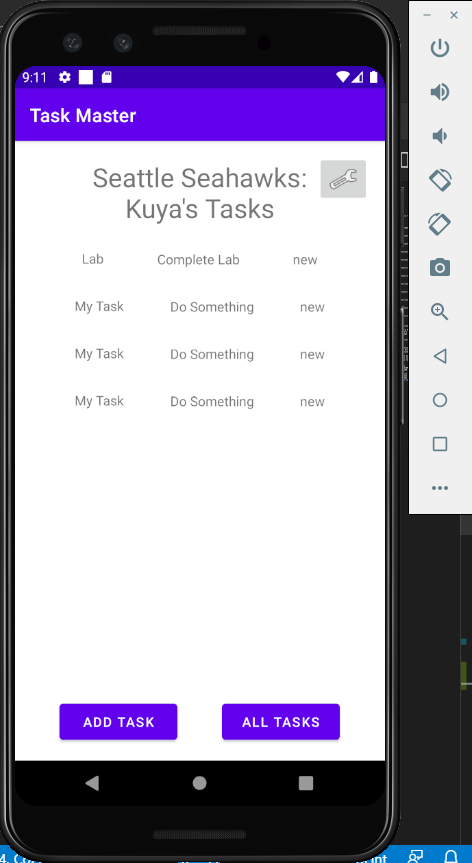

### Updated Homepage 11/2

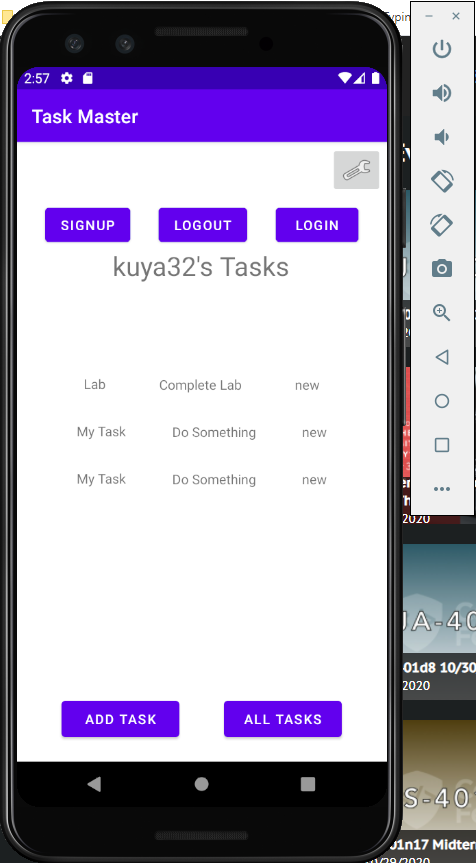

### Signup Page

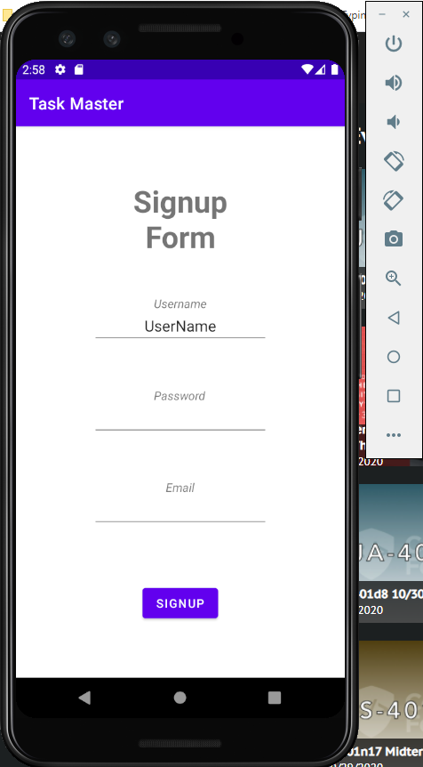

### Confirmation Page

### Login Page

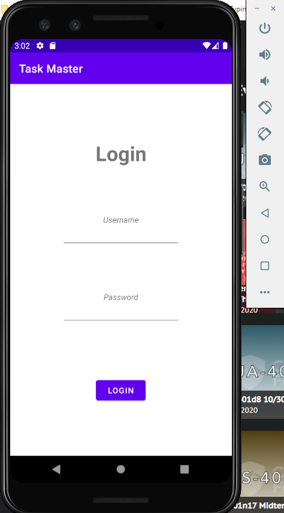

### Add Task

### Updated Add Task 10/22

### Updated Add Task 10/29

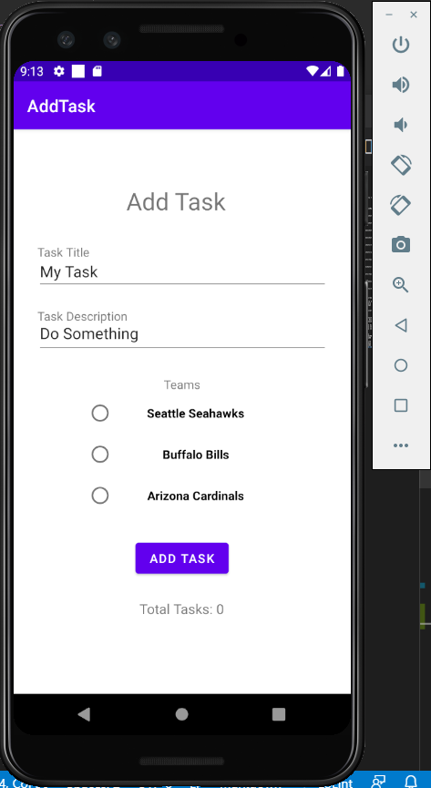

### Updated Add Task 11/3

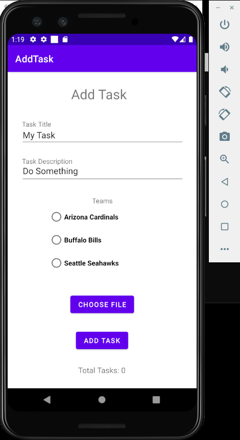

### Submit Confirmation

### All Tasks

### Task Detail

### Updated Task Detail 10/21

### Updated Task Detail 11/3

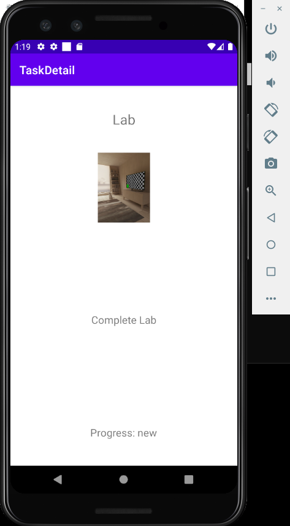

### Updated Task Detail 11/10

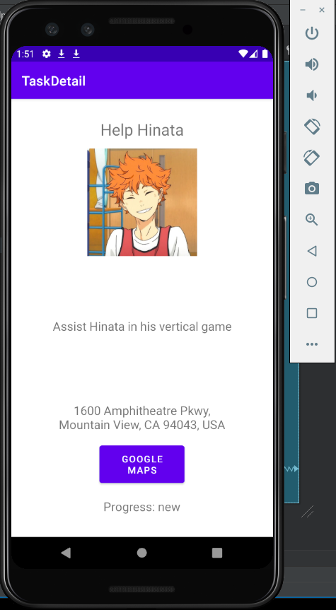

### User Settings

### Update User Settings

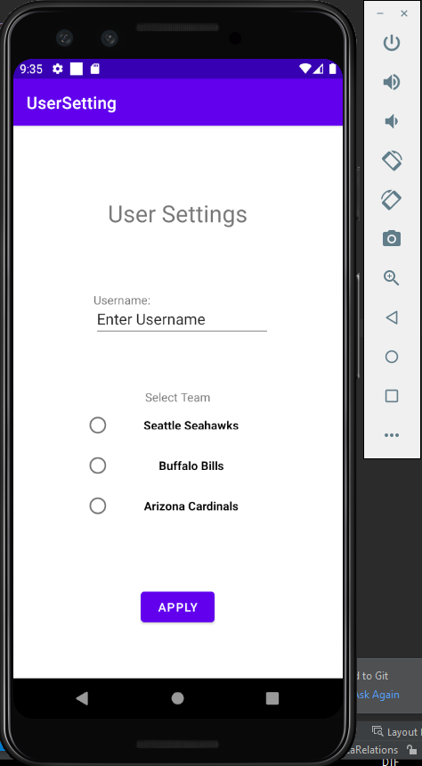

### Confirmation Notication from Firebase

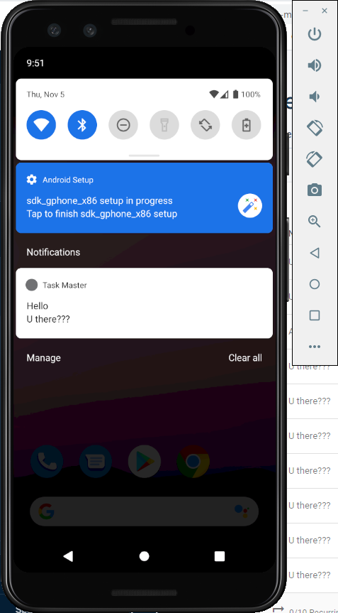

### Confirmation Notication from Pinpoint

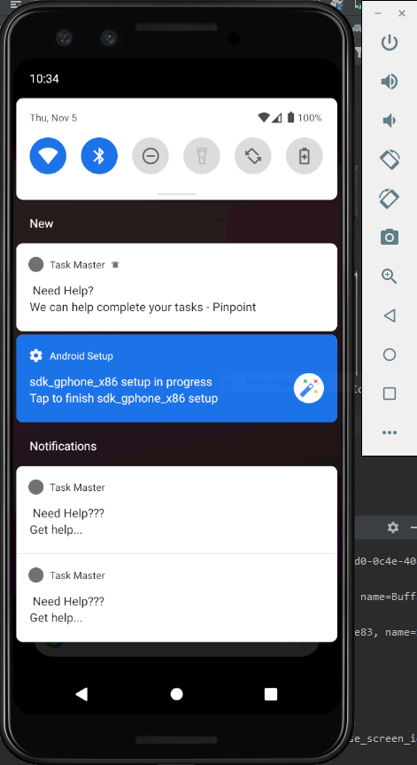

### AWS Analytics Events Data

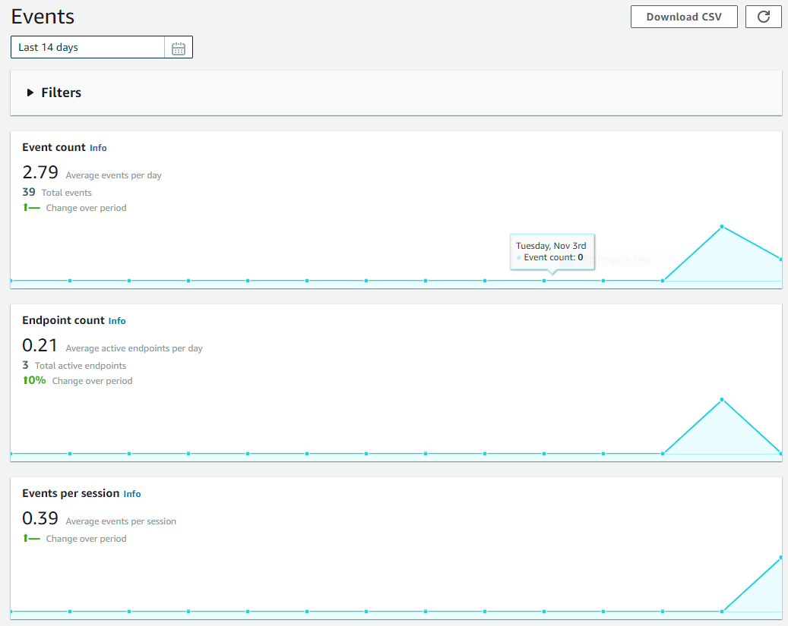

## Daily Change Log

- 10/19/2020
  - Created the home, add, submit confirmation and all tasks pages.
- 10/20/2020
  - Updated the homepage with three more buttons that lead to the new task detail page. Also created a user settings page where the user can update their username.
  - Took out the submit confirmation page after adding a task and replaced with a toast instead.
- 10/21/2020
  - Updated the homepage with the recycler view to show a list of tasks
  - Made the list of tasks clickable
  - Created a task class
- 10/22/2020
  - Updated the Add Task page to save task data to my local database.
  - Refactored homepage RecycleView to display all tasks in my database.
  - Task detail page reflects clicked task title and description.
- 10/26/2020
  - Created Espresso tests for homepage button paths and back button functionality
  - Created Espresso tests for adding a new tasks to the recycler view on homepage
  - Created Espresso tests for adding a new username and have the new username viewable on the homepage
- 10/27/2020
  - Connected to DynamoDB using Amplify
  - Homepage list is updated from DynamoBW
  - Added tasks are now saved to DynamoDB instead of room
- 10/28/2020
  - Created team model with realtion with task model and vice versa
  - Updated add task page to include team selection and save to DynamoDB
  - Updated user settings page to inlcude team selection
  - Homepage title displays user's team selection
- 11/2/2020
  - Created classes and activities for signup, login and user confirmation
  - Added a logout button
  - Updated homepage with more buttons
  - Added Cognito user authentication plugin
- 11/3/2020
  - Connected Amplify Storage to app
  - Added the ability to add attachment to individual tasks
  - Updated detail page to show image selected of task
  - Updated task object in schema to take an additional property
- 11/4/2020
  - Connected AWS Notification Services to my app
  - Able to create and recieve notifications from the Firebase console
  - Able to create and recieve notifications from the Pinpoint console
- 11/5/2020
  - Added Amplify Analytics
  - Created Event Tracking class and methods to go along
    - trackButtonClicked()
    - eventTrackerAppStart()
  - Added methods to all necessary events within app
- 11/10/2020
  - Shared images are available to Add Task page
  - Shared images are viewed in Task Detail page
  